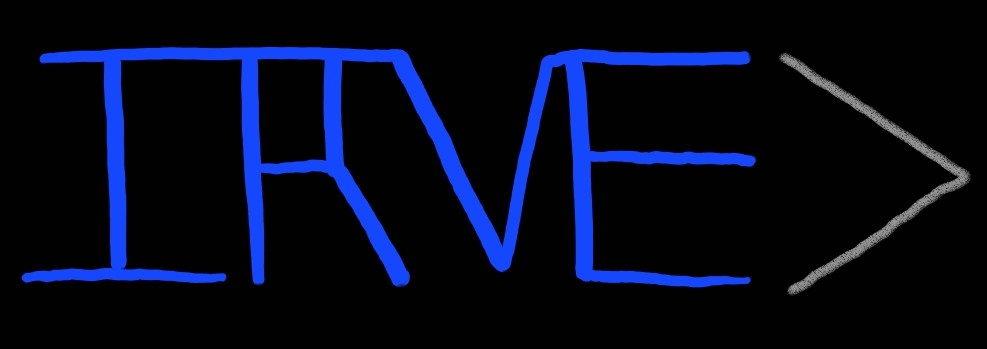

# irve



[](https://github.com/JZJisawesome/irve/actions/workflows/smoke_tests.yml)
[](https://github.com/JZJisawesome/irve/actions/workflows/unit_tests.yml)
[](https://github.com/JZJisawesome/irve/actions/workflows/integration_tests.yml)
[](https://github.com/JZJisawesome/irve/actions/workflows/rvsw_tests.yml)

The Inextensible RISC-V Emulator

IRVE was intended as a "quick and dirty" emulator capable of running the Linux kernel. Since then it has become much more!

## Lore

IRVE is the first step on our journey within an overarching project called AGI, the Angry Goose Initiative.

The plan is to use it to better understand the RISC-V architecture (with a focus on Volume 2 in particular).

Once we do, we can move on to a hardware implementation in SystemVerilog called [LETC](https://github.com/JZJisawesome/letc)!

If you're reading this, as of writing we're in a transition period between wrapping up IRVE and beginning LETC. Exciting stuff!

We do a lot of our planning in [this semi-coherent Google Doc](https://docs.google.com/document/d/1HeZ4l5OxooQuh2kdJ1o-uWJXWzGPsVntSPlf_ByFmWA/edit?usp=drivesdk) if you're interested!

(Also at some point we split IRVE test code off into a hardware-independent repo called [RVSW](https://github.com/JZJisawesome/rvsw).

## Okay enough backstory, I want to try this out!

Awesome! We'll walk you through the steps!

### Get all the things

We highly recommend doing all of this from a Linux system. We have had some success on macOS, but with the RISC-V toolchain in particular you might encounter issues.

Ensure you have a modern G++ compiler installed than supports C++20. (Clang++ works too with some CMake variable tweaks).

You'll also want a cross compiler if you actually want something to *run on the emulator* (though you don't need it for the emulator itself).

We use [riscv-gnu-toolchain](https://github.com/riscv-collab/riscv-gnu-toolchain) for this.

It's imperative that you build the Newlib version (since the RVSW test programs don't use dynamic linking as they are bare-metal).

Also, since IRVE implements RV32IMA (and some other smaller extensions), you must append `--with-arch=rv32ima` and `--with-abi=ilp32` to the `./configure` command.

Lastly, in a directory of your choice, clone this repo:

```
$ git clone https://github.com/JZJisawesome/irve.git
Cloning into 'irve'...
remote: Enumerating objects: 4224, done.
remote: Counting objects: 100% (659/659), done.
remote: Compressing objects: 100% (277/277), done.
remote: Total 4224 (delta 416), reused 476 (delta 377), pack-reused 3565
Receiving objects: 100% (4224/4224), 931.98 KiB | 1.75 MiB/s, done.
Resolving deltas: 100% (2891/2891), done.
$
```

With that, you should be set to continue!

### Compile all the things

We use CMake as our primary build system to compile both `libirve`, our two emulator frontends `irve` and `irvegdb`, and all of our RISC-V test code!

Step 0: Make a build directory in the root of the project with `mkdir build`

Step 1: Go to the build directory with `cd build`

Step 2: Do `cmake ..` to setup CMake (or `cmake -DCMAKE_BUILD_TYPE=Release ..` for a **much faster** release build)

Step 3: Perform the compile with `make`. For speed, you should probably do `make -j <Number of threads here>` instead to use all of your host's threads

NOTE: If you just want to compile `irve` (ex. if you don't have a cross compiler), do `make irve` instead.

## Info About the IRVE RISC-V Environment / Capabilities

### Memory Map

Lower 64MiB of memory is RAM.

Address 0xFFFFFFFF can be used for outputting text (write bytes, then flush to the screen as a new line when \n is written)

### Reset and Interrupts

The entry point is hardcoded to be 0x00000000. It will stay like this for backwards compatibility with assembly (plus it makes writing assembly more intuitive).

MTVEC is fixed and pointing to 0x00000004. It is currently not vectored but may become so in the future.

In effect, this starting part of memory "acts" like a RISC-V vector table, but it also includes a pseudo reset vector as the first entry!

## Coding Style

For convenience, we may use `using namespace irve::internal` in .cpp files. HOWEVER using `using` in any other way is disallowed (particularly in headers).

The only place where `irve_public_api.h` should be included is by consumers of the public API, or by lib/irve_public_api.cpp. No exceptions.

Internal classess/functions in internal headers go into the `irve::internal::FILE_NAME_BEFORE_EXTENSION" namespace, with the exception of `common.h`, which puts everything into `irve::internal`

Public API classes/functions/etc go into the `irve::SUB_NAMESPACE` namespace. SUB_NAMESPACE should logically group the things contained within in some sense.

lib/irve_public_api.cpp should not contain a `using` statement at all to prevent ambiguity since it is the bridge between the internal/public boundary.

## How to cross compile manually


### Assembly

Step 1: Assemble the file like this: `riscv32-unknown-elf-gcc -march=rv32ima -mabi=ilp32 -ffreestanding -nostartfiles -static-libgcc -lgcc -mstrict-align -T path/to/irve.ld path/to/your/assembly_file.s`

BE CAREFUL IF YOU USE THIS COMMAND: `riscv32-unknown-elf-as -march=rv32ima -mabi=ilp32 path/to/your/assembly_file.s`
It does not link the assembly, so references (like to symbols or jump targets) may be unresolved.

### C code

Step 1: Do `riscv32-unknown-elf-gcc -march=rv32ima -mabi=ilp32 -nostartfiles -static -static-libgcc --specs=nosys.specs -lc -lgcc -mstrict-align -T path/to/irve.ld path/to/crt0.s path/to/your/remaining/c/files/here`

NOTE: Software floating point, other missing CPU features will be emulated by libgcc (you won't have to do anything)!

NOTE: The C standard library will be available, BUT since we are using --specs=nosys.specs, you will have to implement certain "system calls" for it in order for ex. `printf` to work.

If we used --specs=nano.specs or others, more would be implemented for us, but Newlib (the c standard library implementation for embedded systems) dosn't know how to use IRVE_DEBUG_ADDR

**I have already done this however! So just include irve_newlib.c in the list of files you are compiling and you'll get these syscalls for free!**

Note: To implement these functions, this may come in handy: https://interrupt.memfault.com/blog/boostrapping-libc-with-newlib#implementing-newlib

#### How I was compile C code before I thought of the possiblity of having a C library as a possiblity:

NOTICE the use of crt0_no_newlib.s

`riscv32-unknown-elf-gcc -march=rv32ima -mabi=ilp32 -ffreestanding -nostartfiles -static-libgcc -lgcc -mstrict-align -T path/to/irve.ld path/to/crt0_no_newlib.s path/to/your/remaining/c/files/here`

#### Special case: How I compiled hello_newlib.c

Same command as the regular C code section, but I DIDN'T USE irve_newlib.c

### End of both

Step 2: Objcopy the resulting a.out file to a 32-bit (4-byte) Verilog hex file with `/opt/riscv/bin/riscv32-unknown-elf-objcopy ./a.out -O verilog --verilog-data-width=4 path/to/result.txt`

## What's all this I've been hearing about XRVE?

Originally the plan was to write an emulator in Rust called XRVE: The eXtensible RISC-V Emulator.

I fr***ing LOVE Rust, but just wasn't up to fighting the borrow check this time around.

At the moment, the plan is to do XRVE after LETC, though it likely would be seperate from AGI and quite a while in the future.

In the end I think it was good to do it this way as, now that we've experimented with how to best lay out things for emulation in C/C++, we can better plan out the XRVE Rust code base in the future!

## Automated Testing

We use Github Actions for our default IRVE configuration.

Additionally I have a private Jenkins setup that tests some other configurations automatically (ex. with Rust enabled). I run my Jenkins agents on several University of Waterloo engineering servers. It's great having access to those computing resources, so to whom it may concern, thanks a ton!

# Licensing

## IRVE code 

See the LICENSE file for more info

## Other code

### xrve

Developed alongside/before/after but mostly after eventually IRVE (that was a mouthful)

Licensed in the same way :)

### rv32esim

Based in part on JZJ's old rv32esim

I (John Jekel) freely release that old code under the MIT License too!

### Nick's Old Emulation Code

This served as a good base for parts of IRVE. Thanks Nick!

### jzjcoresoftware

MIT License

Copyright (c) 2020 John Jekel

Permission is hereby granted, free of charge, to any person obtaining a copy
of this software and associated documentation files (the "Software"), to deal
in the Software without restriction, including without limitation the rights
to use, copy, modify, merge, publish, distribute, sublicense, and/or sell
copies of the Software, and to permit persons to whom the Software is
furnished to do so, subject to the following conditions:

The above copyright notice and this permission notice shall be included in all
copies or substantial portions of the Software.

THE SOFTWARE IS PROVIDED "AS IS", WITHOUT WARRANTY OF ANY KIND, EXPRESS OR
IMPLIED, INCLUDING BUT NOT LIMITED TO THE WARRANTIES OF MERCHANTABILITY,
FITNESS FOR A PARTICULAR PURPOSE AND NONINFRINGEMENT. IN NO EVENT SHALL THE
AUTHORS OR COPYRIGHT HOLDERS BE LIABLE FOR ANY CLAIM, DAMAGES OR OTHER
LIABILITY, WHETHER IN AN ACTION OF CONTRACT, TORT OR OTHERWISE, ARISING FROM,
OUT OF OR IN CONNECTION WITH THE SOFTWARE OR THE USE OR OTHER DEALINGS IN THE
SOFTWARE.

### Others

Any other bits of code from other places that didn't make it here will recieve attribution alongside where they're used! :)


IRVE - "Working our way up to stuff!"
