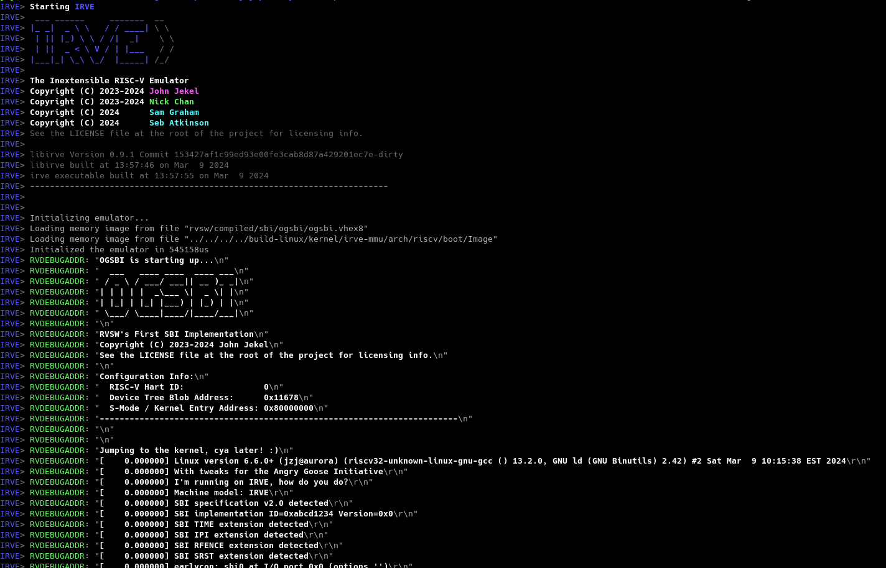
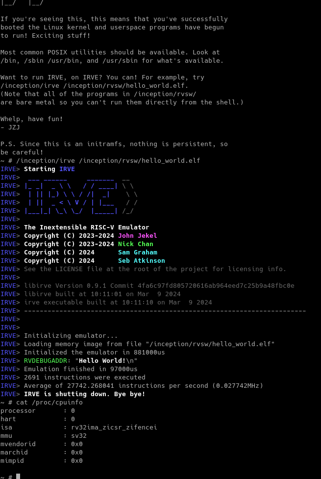

# irve

The Inextensible RISC-V Emulator

IRVE was intended as a "quick and dirty" emulator capable of running the Linux kernel. Since then it has become much more!

[Here's a YouTube video of Linux running on the emulator](https://youtu.be/7bEB80RHVqs). Yes, IRVE can in fact emulate itself!

## Lore

IRVE is the first step on our journey within an overarching project called AGI, the Angry Goose Initiative.

The plan is to use it to better understand the RISC-V architecture (with a focus on Volume 2 in particular).
Once we do, we can move on to a hardware implementation in SystemVerilog called [LETC](https://github.com/angry-goose-initiative/letc)!

At some point also we split IRVE test code off into a hardware-independent repo called [RVSW](https://github.com/angry-goose-initiative/rvsw).

Keep in mind that IRVE is slow, managing only about 50MHz on a modern Ryzen system even in release mode. The purpose of this was to learn the architecture, not knock the socks off of QEMU or anything :)

## Okay enough backstory, I want to try this out!

Awesome!

We recommend starting out with running a "hello world" program. Check out [this wiki page](https://github.com/angry-goose-initiative/wiki/wiki/Quickstart:-Running-Hello-World-on-IRVE) to get started!

Want to run Linux on the thing? Check [this out](https://github.com/angry-goose-initiative/wiki/wiki/Linux-shenanigans).

Information about the IRVE RISC-V environment and its capabilities can be found [here](https://github.com/angry-goose-initiative/wiki/wiki/General-EEI-Info).

## Screenshots

### Booting Linux!

### "Have you seen the movie Inception before?"

## Licensing

### IRVE code 

See the LICENSE file for more info

### rv32esim

Based in part on JZJ's old rv32esim

I (John Jekel) freely release that old code under the MIT License too!

### Anything else

Any other bits of code from other places that didn't make it here will recieve attribution alongside where they're used! :)

IRVE - "Working our way up to stuff!"
